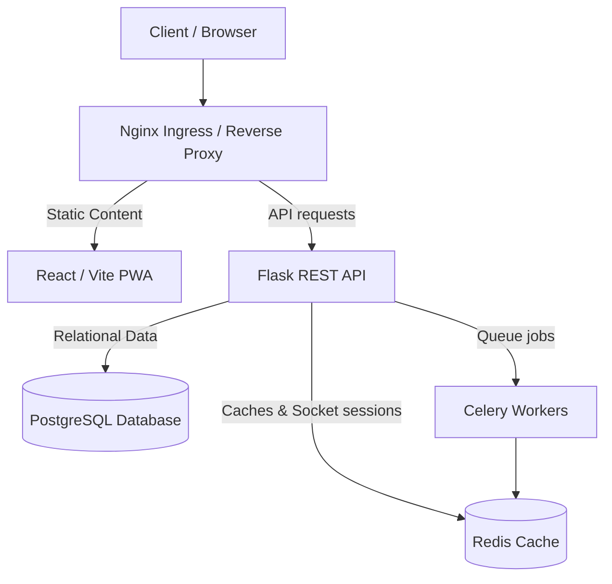

# Irfan HomeCare System Architecture

## Technology Stack
- **Frontend**: React (Vite, TypeScript, Tailwind CSS, Recharts)
- **Backend**: Flask, Flask-SQLAlchemy, Flask-SocketIO, Celery
- **Database**: PostgreSQL (Relational persistence), Redis (Broker/Cache)
